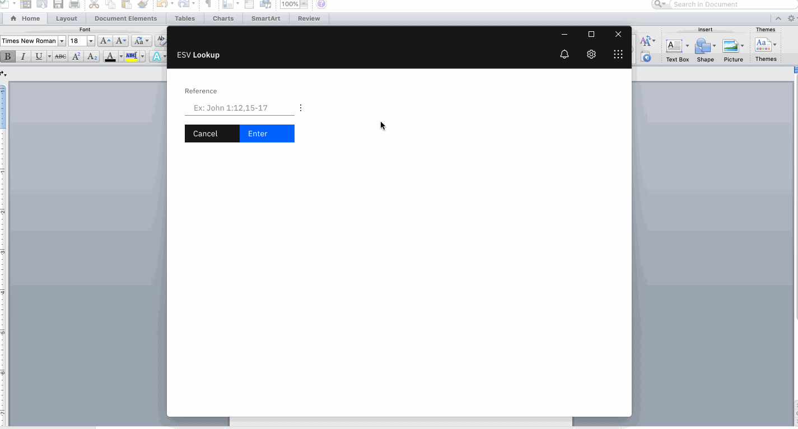

## ESV Lookup ##
#### Auto-formats and copies any ESV reference you lookup! :100: :boom: ####

### Features ###
* Quick lookup of any reference :zap:
* Search the entire ESV for any word or phrase :mag_right:
* Easily format every verse you lookup. Don't like those headers? No problem! :raised_hands:
* Auto-updates so you always get the latest and greatest :airplane:
* Download verses to mp3! :headphones:

<p align="center">
  
</p>

### Downloads ###
<a href="https://github.com/basketbaseb/electron-esv-lookup/releases/latest">Let's go!</a>

#### Development

```
npm install
npm run start
```
