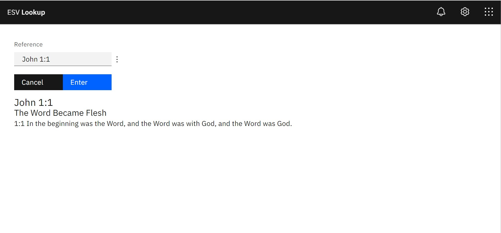

<p align="center">
  
</p>

#### Install dependencies

```
npm install
```

### Usage

#### Run the app

```
npm run start
```

#### Build the app (automatic)

```
npm run package
```

#### Build the app (manual)

```
npm run build
```

#### Test the app (after `npm run build`)
```
npm run prod
```
